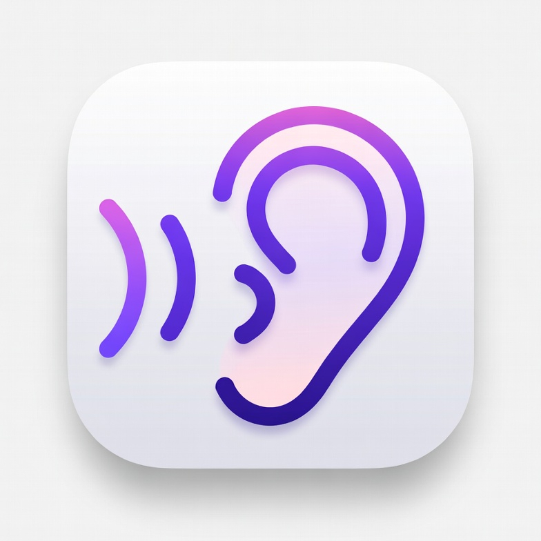
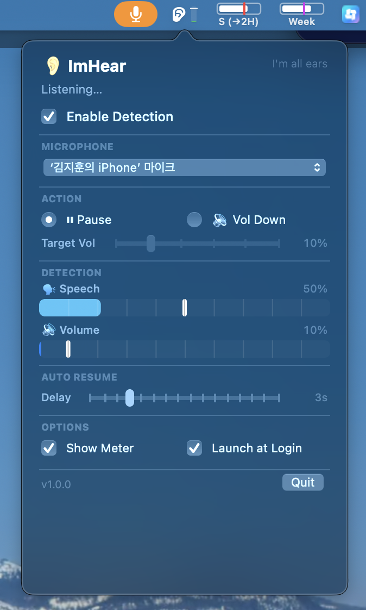

<p align="center">
  
</p>

# ImHear

<p align="center">
  
  
  
  
</p>

A lightweight macOS menu bar app that detects nearby speech and automatically pauses or lowers your media volume.



## Features

- **Speech Detection** — Uses Apple's SoundAnalysis framework to detect human speech via your microphone
- **Auto Pause/Resume** — Automatically pauses media when speech is detected, resumes after a configurable delay
- **Volume Duck** — Alternatively, lower the system volume instead of pausing
- **Live Status Bar Meter** — Real-time visualization of speech and volume levels in the menu bar
- **Configurable Sensitivity** — Adjust speech detection threshold and volume gate independently
- **Auto Resume Timer** — Set a delay (0–15s) before media resumes after speech stops
- **Launch at Login** — Optional auto-start on login
- **Auto Update** — Checks for new releases from GitHub and updates in one click
- **Minimal & Native** — Pure AppKit, no Electron, no SwiftUI, single binary (~1MB)

## Requirements

- macOS 14.0 (Sonoma) or later
- Apple Silicon or Intel Mac
- Microphone permission
- Accessibility permission (for media control)

## Install

### Download

Download the latest release from the [Releases page](https://github.com/tlqhrm/ImHear/releases/latest).

1. Unzip `ImHear.zip`
2. Move `ImHear.app` to `~/Applications` or `/Applications`
3. Launch — grant Microphone and Accessibility permissions when prompted

### Build from Source

```bash
git clone https://github.com/tlqhrm/ImHear.git
cd ImHear
bash build.sh
```

The app will be built to `~/Applications/ImHear.app`.

## Usage

ImHear lives in your menu bar. Click the ear icon to open settings:

- **Enable Detection** — Toggle speech detection on/off
- **Microphone** — Select which mic to use
- **Action** — Choose between Pause or Volume Down
- **Detection** — Adjust speech sensitivity and volume threshold
- **Auto Resume** — Set delay before media resumes
- **Options** — Toggle status bar meter, launch at login

## How It Works

ImHear uses `AVAudioEngine` with Apple's `SNClassifySoundRequest` (SoundAnalysis framework) to classify audio from your microphone in real-time. When speech confidence exceeds your threshold and volume is above the gate, it triggers a media control action via media key simulation.

## License

MIT
